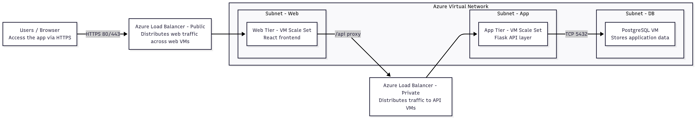
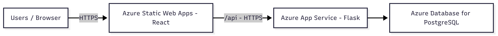

# IAAS Infrastracture Explanation
At first, we need to create Virtual Network with subnets, Web, App, DB. afterwards, we need to add NSGs.
Then, we need to put a Load Balancer that will evenly distribute incoming traffic.
For VMs, we need to create 3 VMs, the first one will be for the Front-end (React), the second will be for Flask, and the third for Database (Postgres)
# PAAS Infrastracture Explanation
The PAAS infrastructure has fewer component than the IAAS, because anything related to VMs is now handled by Azure
In this scenario the front-end (React) will be deployed to Azure static web apps using automatic CI/CD from GitHub.
The API (Flask) will be deployed to Azure app service and the Database(Postgres) will be deployed to Azure Database for Postgresql

# IAAS Diagram

# PAAS Diagram
