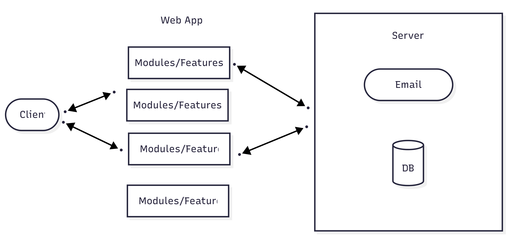

# Cloud Migration and Cloud Adoption – A Comparative Study of PaaS, IaaS, and SaaS Across Cloud Providers

## Section 1: On-Premises Solution Design
### On-premises architecture

### Key components that need to be migrated
Web App : We can deploy it in PAAS, especially if we don't want the headache of managing the VMs

Database : We can utilize Azure SQL for our APP, which is also a PAAS

File storage : Definitely PAAS, better to utilize Azure Blops to manage our files especially if we have a big amount.

Networking : There are different options we can choose from what we need for our app such as Azure 
Firewall, Azure DDOS protec tion, Azure traffic manager.

Email service : We can opt in to Office 365, which is a SaaS solution, so there’s no need to build that functionality into our app

## Section 2: Migration Strategies
### Proposed migration strategies
#### Web Application : 
Migration strategy : 
1. We use Lift & shift, we move the web app into Azure App service which is a PAAS if we want less control.
2. In the phase we can do modernization, we start to break the app into microservices.
#### Database
Migration strategy : We can utilize Azure SQL Managed instance or Azure SQL managed instance, the former will keep us SQL server features. with PAAS we will have backup for our DB
#### File Storage
Migration strategy : Azure Blop storage (PAAS) is the way if we have different type of files, photos, videos, documents etc...
#### Networking
Migration strategy : If our app is based on PAAS, we can still use PAAS for networking such as Azure firewall, NSG, however we can also use IAAS if we want more security by using VNets
#### Email
Migration strategy : If the company is still relying on services like Microsoft exchange or even their own SMTP server, in this situation we can easily migrate them to Office 365 (IAAS)
### Hybrid approach
The hybrid approach I see from my perspective is to use PAAS for the Web App, DB, File Storage and SAAS for email, and IAAS for networking to have more control of the security, traffic especially when scaling
### Detailed migration plan
#### Assessment
We need to know the app we have, DB and dependencies then we can decide if we want to Rehost, refactor or even replace
#### Rehost
In this step we move the app as it is to Azure, it is usually fast , but could need some adjustment 
#### Refactor
In this step, we need to do some changes to our app in order for it to use PAAS services like (App service, SQL or Blop)
##### Re-architect
This step usually takes more time, as we must redesign everything into microservices, this is what could make our app scalable, however it needs more time and effort.