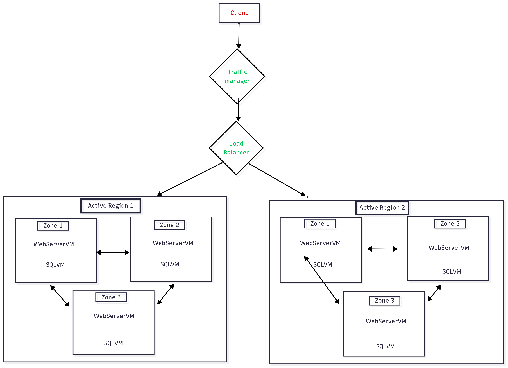

# LAB 4

## Target Architecture

----

## Description

#### 1. Client Access
- The **Client** is at the top, representing users accessing the application through a browser or app.

#### 2. Traffic Distribution
- Requests first pass through a **Traffic Manager**.  
  - This component directs traffic to the most appropriate region based on health, latency, or geographic routing rules.

- Then, traffic goes to a **Load Balancer**.  
  - The load balancer distributes incoming requests across multiple servers within a region to ensure even workload distribution and fault tolerance.

#### 3. Active Regions
- There are **two Active Regions** (Region 1 and Region 2).  
  - This setup provides **geo-redundancy** and ensures continuity in case one region fails.

#### 4. Availability Zones
- Each region has **three Availability Zones (Zone 1, Zone 2, Zone 3)**.  
  - Within each zone:
    - **WebServerVM** handles web traffic and application logic.
    - **SQLVM** hosts the database services.

- The zones inside each region are **interconnected**, allowing replication and synchronization of both web and database tiers for resilience and consistency.

#### 5. Redundancy and Synchronization
- Inside a region, zones are connected with arrows, indicating **replication and failover**:
  - If one zone fails, the other zones in the same region can handle requests.
- Across regions, both Region 1 and Region 2 are active, supporting **active-active redundancy**.  
  - This means the system can serve clients from either region depending on traffic manager rules.
----
## Migration Steps

#### 1. Replication of Virtual Machines
- Create copies of WebServerVM and SQLVM in the secondary region.
- Ensure configurations match with the primary region.

#### 2. Configuration of Load Balancers
- Set up load balancers within each region to distribute traffic across zones.
- Configure a global traffic manager to route traffic between regions.
- Add health checks to monitor availability.

#### 3. Database Replication and Failover
- Enable database replication between regions.
- Configure automatic or manual failover.
- Test failover to ensure data integrity and minimal downtime.
